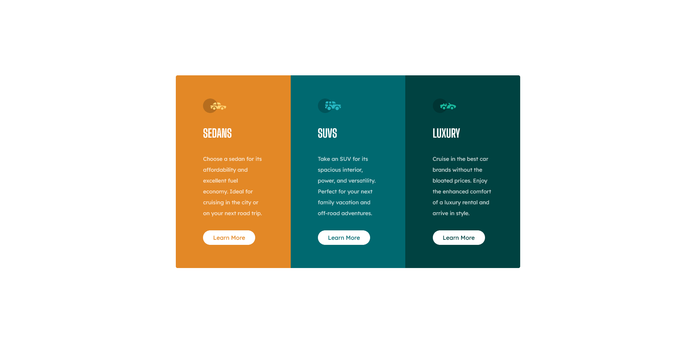

# Frontend Mentor -  3 Column Preview Card Component Solution
 solution

This is a solution to the [3 Column Preview Card Component challenge on Frontend Mentor](https://www.frontendmentor.io/challenges/3column-preview-card-component-pH92eAR2-/hub). Frontend Mentor challenges help you improve your coding skills by building realistic projects.

## Table of contents

- [Overview](#overview)
  - [The challenge](#the-challenge)
  - [Screenshot](#screenshot)
  - [Links](#links)
- [My process](#my-process)
  - [Built with](#built-with)
- [Author](#author)

## Overview

### The challenge

Users should be able to:

- View the optimal layout depending on their device's screen size
- See hover states for interactive elements

### Screenshot

#### Desktop View

#### Mobile View

### Links

- Solution URL: (https://www.frontendmentor.io/challenges/3column-preview-card-component-pH92eAR2-/hub)
- Live Site URL: (https://3-column-preview-card-component-main-theta-three.vercel.app/)

## My process

### Built with

- Semantic HTML5 markup
- CSS custom properties
- Flexbox
- CSS Grid

## Author

- Linkedin - [Abdulaziz Shebani](https://www.linkedin.com/in/abdulazizshebani/)
- Frontend Mentor - [@ashebani](https://www.frontendmentor.io/profile/ashebani)
- Instagram - [@abdulaziz.shebani](https://www.instagram.com/abdulaziz.shebani/)
